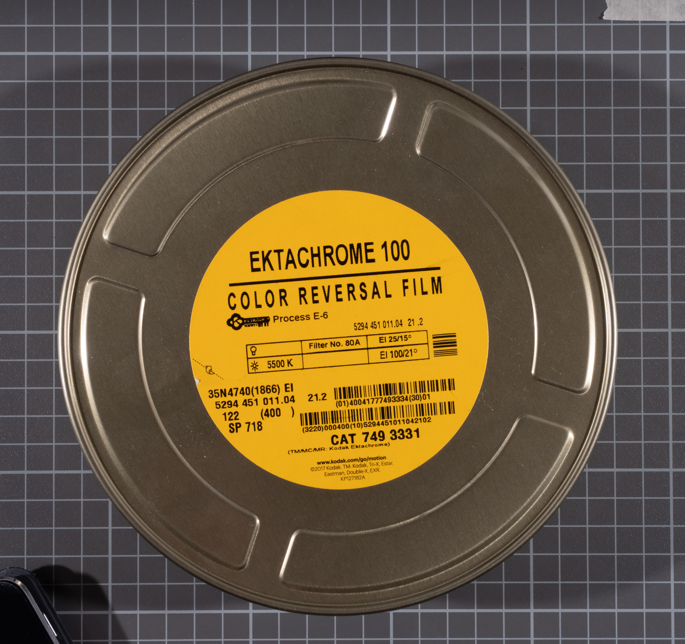
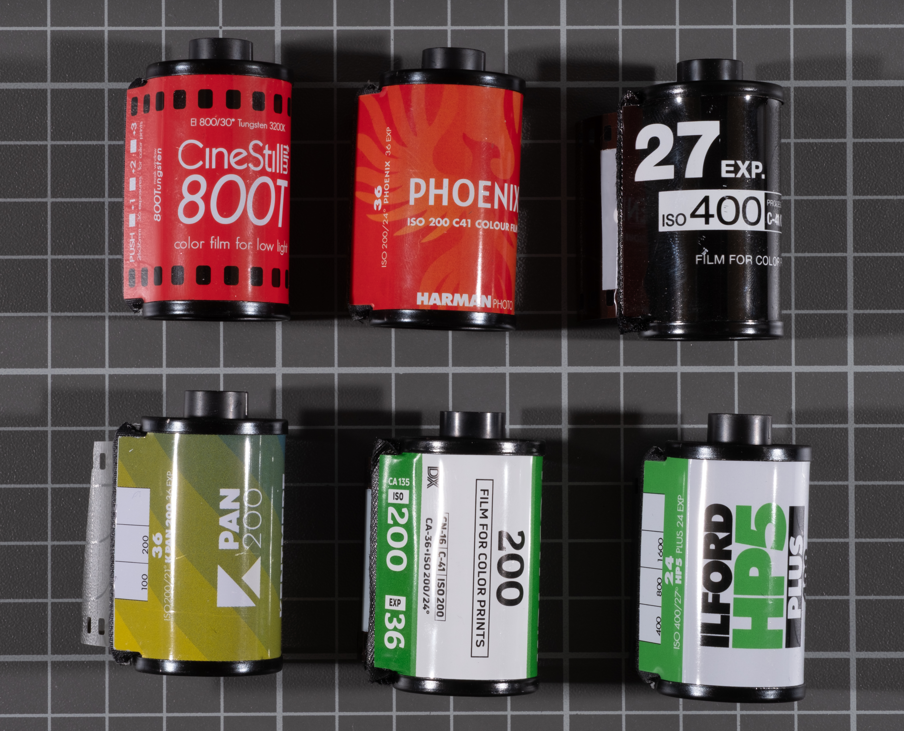
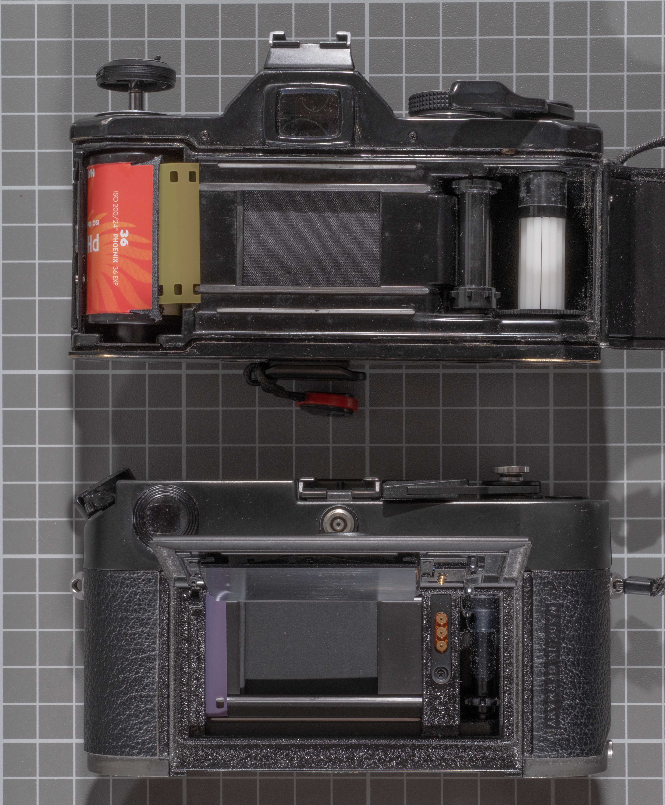
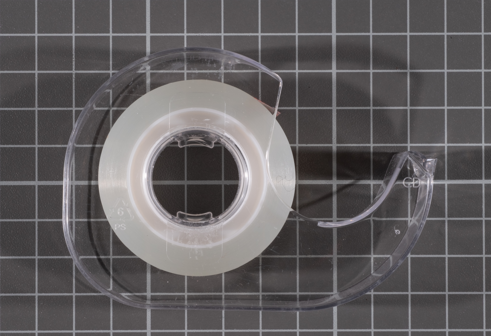
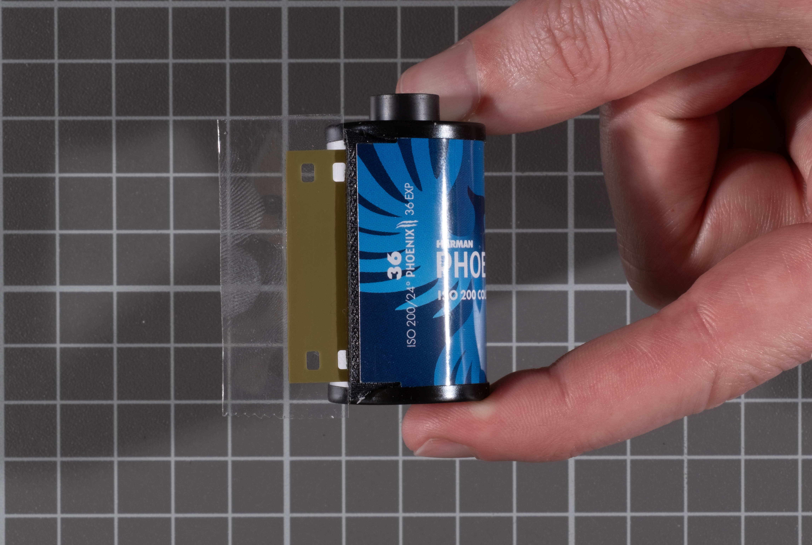
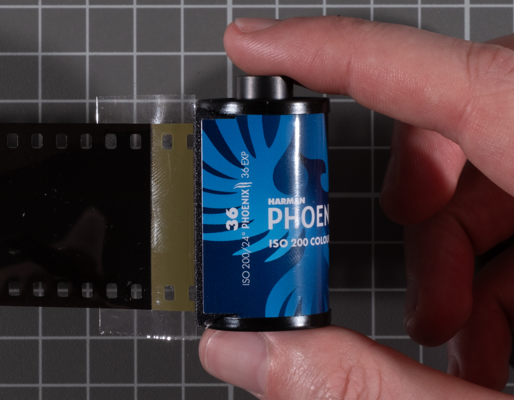
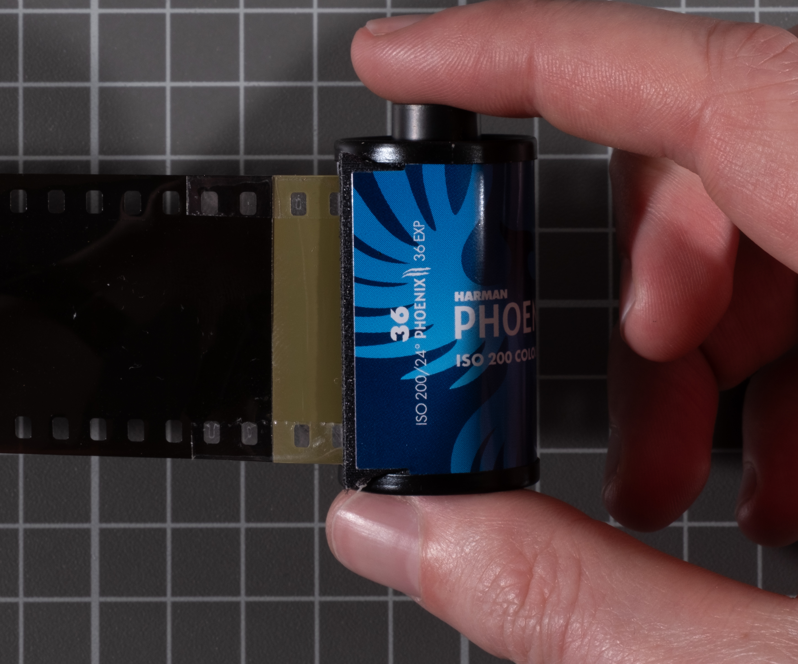
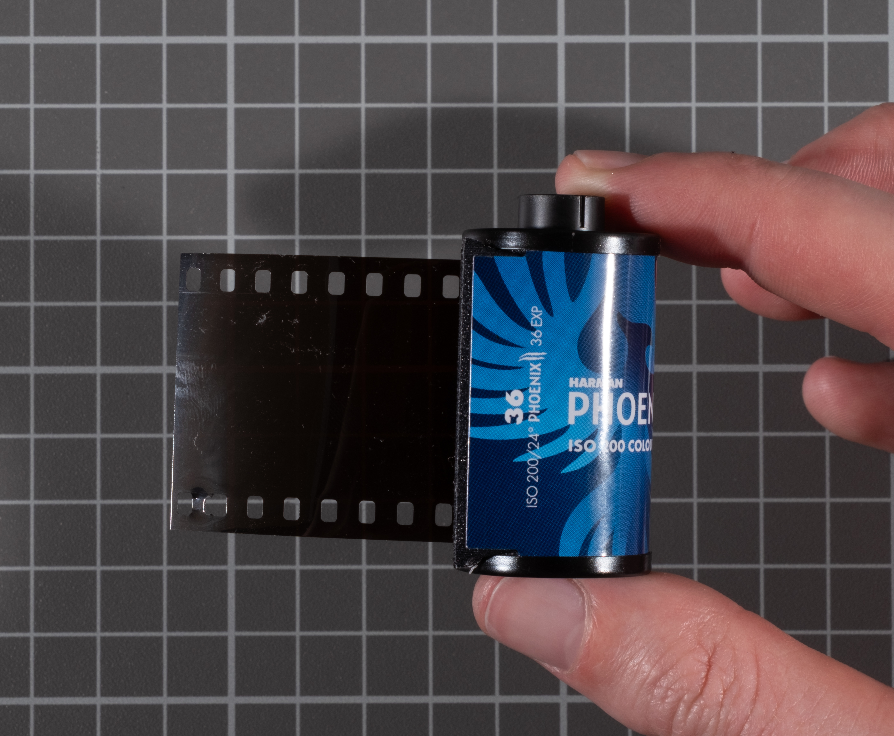
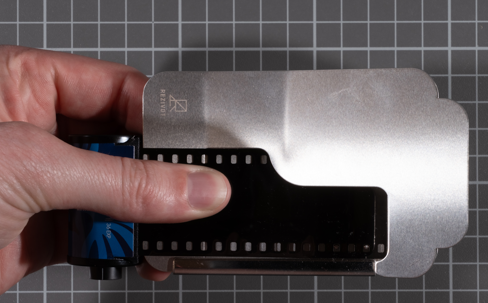
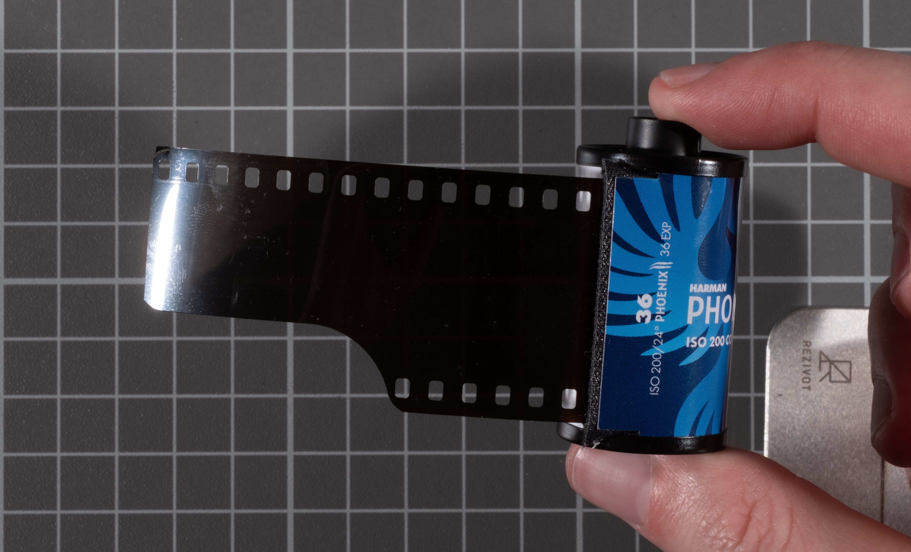

*Bulk Rolling* refers to taking a length of 35mm film, attaching, rolling, and cutting into a standard 35mm cassette.. This practice dates back to the first 35mm camera made by inventor Oskar Barnack in 1913, who revolutionized the standard 35mm format from cinema film and expanded the image to fit horizontally on the film base. Cinema film can still be cut down today with the right tools.

### Why Bulk Roll?

There are three main reasons to roll your own film instead of buying a pre-packed 36 or 24 exposure 35mm cassette:

1. Cheaper per-roll cost
2. Custom length roll (1 - ~40 frames)
3. The film you want is only available in longer rolls

While all of these things are possible, the tools and materials can sometimes exceed the savings.

### Why NOT to Bulk Roll?

Bulk rolling isn’t all sunshine and rainbows. Ruining a 100ft roll of film due to improper light-safe techniques is entirely possible. Although this is the most common fear, there are many more reasons bulk rolling can be troublesome:

- Worn cassettes cause light leaks
- Improper loading leading to the loss of the final frame on the roll
- Fingerprints on the film caused by manual loading
- Missing sprocket holes from bad rolling tools causing camera lock-up
- Damaged film from bulk rolling tools
- Image artifacts from stress on the film during loading
- Camera fails to pick up the film due to an improperly cut leader

Wow! Why am I even doing this if so many things can go wrong? Well, if you’re already shooting film, you should start to expect a long list of dos and don’ts from existing literature on the subject. My hope in this guide is to pass on my experience bulk rolling film and the habits and rituals I use to avoid all of these problems.

### Materials Needed

This section title is a misnomer. *Needed* is a relative term. You could theoretically take 100ft of film, a used cassette, and a piece of tape and curl up under a thick blanket in a bathtub with the door closed and spool the film onto the cassette, then rip the film with your teeth. In that case, you only need Scotch tape and a dream.. But, just as I keep spending my retirement fund on cameras and lenses I don’t need, sometimes there are things in life that make it easier and more enjoyable to do things. As such, these sections are relatively ordered in the necessity of the items required to bulk roll film. I suggest setting a budget and then buying whatever is within that.

### Basic Consumables

#### Empty Film Cassette

The best film cassettes are metal, have only been used once, and are made by a reputable film company, such as Ilford or Kodak. If you develop at home, you should have these lying around, or if you get your film developed at a lab, you can usually ask for extra empty cassettes.

The most important quality of used cassettes is the correct amount of film protruding to attach the fresh film. If it is too short, you risk damaging the felt or having it detach when you reach the end of your roll. If it is too long, you will lose frames at the end of your roll as you will unknowingly wind the exposed film in front of the shutter.

You can determine the correct length of film needed by setting the cassette in the back of your camera (if it’s an SLR with an open back loading system), then pulling the film until it’s tight and observing the proximity to the shutter. The film should be at least a half inch from the shutter. It should also not be so short that half the width of the tape you’re using is within 2-4mm of the felt light seal.

TLDR: The protruding film should be around 3/4 of an inch or 2 cm from the felt light seal on your cassette.

Used cassettes can be found for free in Seattle, with proper length, from:

- Panda Lab
- Shot on Film

The other option is to use ready-to-use bulk loading cassettes. These are the most common models:

| Cassette                                                                                                                                            | Avg. Cost per Cassette |
| --------------------------------------------------------------------------------------------------------------------------------------------------- | ---------------------- |
| [Flic-Film 2 piece plastic bulk loading cassettes](https://www.glazerscamera.com/products/flic-35mm-bulk-cassettes-x5?_pos=5&_sid=7a60bebc1&_ss=r)* | $2-2.15                |
| [Adorama / Ultrafine plastic screw top cassettes](https://www.ultrafineonline.com/10re35plcawi.html)*                                               | $2-3                   |
| ["Russian" 135 reloadable metal film cans](https://www.ebay.com/sch/i.html?_nkw=135+metal+cassette&_sacat=0&_from=R40&_trksid=p4432023.m570.l1313)  | $5-8                   |
| Kodak Snap-Caps†                                                                                                                                    | $3-5                   |
| Used Cassettes                                                                                                                                      | *✨free✨*               |

*\*Available locally in Seattle from Glazers - limited stock*

*†No longer in production, can be found used.*

I have used all of these except the “Russian” ones. Both types of plastic cassettes succeeded in their first use, but had light leaks on any further uses. The snap caps are great, and more durable, but usually cost between $3-5 a cassette which, when compared to free used ones, is a horrible deal.

You will find reloadable cassettes by Leica and Nikon but do not be deceived: these are for specific cameras and are known to mangle film anyway.

#### Tape

Really? Tape matters? Yes.

I started out a naive bulk loader using my finest gaffers tape on one side of my film connecting to the leader from the empty roll. This is a critical mistake. Gaffer tape, duct tape, or any cloth tape is too thick to fit 36 exposures onto a roll. Any thin film tape will be fine. I use the Scotch gift wrapping tape. For best adhesion, apply the tape parallel to the seam between the fresh film and the film in the cassette so that you can wrap the edges and tape both sides with one piece.

Tape:
- Scotch Gift Tape
- Any thin film-based tape

#### Scissors

No tricks here, as long as you can cut some small curves (for a leader) it should work great.

#### Daylight Loader

Daylight loaders come in very different sizes and shapes with many different features. They all have their own problems and there is no clear winner.

Do I really need a daylight loader? Probably. It’s the main piece of gear for this process and where the greatest amount of your bulk loading budget should be spent. Take the amount of film you have shot recently and use that to determine how much to spend. Here’s what I did:

I shot seventy eight rolls in the past 2.5 years. sixteen of those were Kodak Gold 200, and thirty were black and white Ilford films. I could replace those thirty and sixteen with two 100’ rolls of color and one 100’ black and white film, probably more if I stopped buying every cool-looking film stock at Glazers. To cover my film needs I would need five 100’ rolls of bulk film, as there are eighteen rolls in 100’.

I can calculate the cost of my bulk roller in a year per roll as 5 *** 18 (rolls per 100')

If I spent $120 on my bulk loader that’s $1.33/roll which is usually half of the cost savings you’d get by bulk rolling (more on that later). *Probably not worth it.*

### Film Available

Finding bulk film can be challenging, but can be separated into three distinct categories.

#### Commercial Photo Film

Most film manufacturers sell most of their catalog in bulk rolls, with the notable exception of Kodak. After their last bankruptcy they gave the rights to sell photo film in bulk to Kodak Alaris, a private equity holding company. Kodak Alaris has been only selling the film with the intention of the highest profit margins in low volume, discontinuing all bulk color film. Similarly, Ilford’s new color films are produced in small batches and not sold in bulk.

I have provided links to my local film store, Glazer’s which has limited stock, or wherever seems the cheapest. I have also omitted some weird listings on BHPhoto that look similar to respooled Foma film, except the Arista EDU as freestyle imports it in bulk and sells below the Foma price point here in the US.

**Prices as of 6/12/2026**, All 100ft.

| Film                                                         | Type    | ISO       | Link                                                         | Price (USD) | Price Per Roll (USD) | Savings (USD) |
| ------------------------------------------------------------ | ------- | --------- | ------------------------------------------------------------ | ----------- | -------------------- | ------------- |
| Kodak Tri-X 400                                              | B&W     | 400       | [Glazer's](https://www.glazerscamera.com/collections/35mm-film/products/kodak-tri-x-135x100) | 239.95      | 13.32                | -55.45        |
| Kodak T-Max 400                                              | B&W TG  | 400       | [Glazer's](https://www.glazerscamera.com/collections/35mm-film/products/t-max-400-35mmx100) | 199.95      | 11.11                | 2.55          |
| Kodak T-Max 100                                              | B&W TG  | 100       | [BHPhoto](https://www.bhphotovideo.com/c/product/1976545-REG/kodak_8570541_0126_t_max_100_black_and.html) | 169.00      | 9.39                 | 46.10         |
| Ilford HP5+ 400                                              | B&W     | 400       | [Glazer's](https://www.glazerscamera.com/collections/35mm-film/products/ilford-hp5-plus-135x100) | 167.99      | 9.33                 | 38.83         |
| Ilford FP4+ 125                                              | B&W     | 125       | [Glazer's](https://www.glazerscamera.com/collections/35mm-film/products/fp4-plus-35mmx-100ft-roll) | 141.95      | 7.89                 | 91.87         |
| Ilford Delta 100                                             | B&W TG  | 100       | [BHPhoto](https://www.bhphotovideo.com/c/product/108312-REG/Ilford_1780598_Delta_100_Professional_35mm_100.html) | 168.99      | 9.39                 | *136.83*      |
| Ilford Delta 400                                             | B&W TG  | 400       | [BHPhoto](https://www.bhphotovideo.com/c/product/24618-REG/Ilford_1765829_Delta_400_Professional_35mm_100.html) | 178.50      | 9.92                 | *127.32*      |
| Ilford Delta 3200                                            | B&W TG  | 1000      | [BHPhoto](https://www.bhphotovideo.com/c/product/1899530-REG/ilford_1182417_delta_3200_professional_black.html) | 215.99      | 12.00                | *143.83*      |
| Ilford XP2 Super                                             | B&W C41 | 400       | [BHPhoto](https://www.bhphotovideo.com/c/product/153926-REG/Ilford_1839621_XP_2_Super_35mm_100.html) | 175.95      | 9.78                 | *138.87*      |
| Ilford Pan F+                                                | B&W     | 50        | [BHPhoto](https://www.bhphotovideo.com/c/product/25308-REG/Ilford_1707814_Pan_F_Plus_35mm.html) | 160.99      | 8.94                 | *162.83*      |
| Kentmere Pan 400                                             | B&W     | 400       | [Glazer's](https://www.glazerscamera.com/collections/35mm-film/products/kentmere-b-w-400-35mm-100-feet) | 92.95       | 5.16                 | 41.87         |
| Kentmere Pan 200                                             | B&W     | 200       | [BHPhoto](https://www.bhphotovideo.com/c/product/1887917-REG/kentmere_6015088_400_black_and_white.html) | 108.95      | 6.05                 | 34.15         |
| Kentmere Pan 100                                             | B&W     | 100       | [Glazer's](https://www.glazerscamera.com/collections/35mm-film/products/kentmere-b-w-100-35mm-100ft) | 102.99      | 5.72                 | 40.11         |
| Arista EDU Ultra 400 (aka Fomapan 400)                       | B&W     | 400       | [Freestyle](https://www.freestylephoto.com/190410-Arista-EDU-Ultra-400-ISO-35mm-x-100-ft.) | 89.99       | 5.00                 | 35.83         |
| Arista EDU Ultra 200 (aka Fomapan 200)                       | B&W     | 200       | [Freestyle](https://www.freestylephoto.com/190210-Arista-EDU-Ultra-200-ISO-35mm-x-100-ft.) | 89.99       | 5.00                 | 43.03         |
| Arista EDU Ultra 100 (aka Fompan 100)                        | B&W     | 100       | [Freestyle](https://www.freestylephoto.com/190110-Arista-EDU-Ultra-100-ISO-35mm-x-100-ft.) | 84.99       | 4.72                 | 31.83         |
| Rollei IR 400 (aka Aviphot 200, Rollei Superpan 200 and 400) | B&W IR  | 400 (200) | [BHPhoto](https://www.bhphotovideo.com/c/product/1349023-REG/rollei_8104135_infrared_35mm_x_100.html) | 124.50      | 6.92                 | *109.32*      |
| Kono Color 200 (by Orwo)                                     | Color   | 200       | [BHPhoto](https://www.bhphotovideo.com/c/product/1906384-REG/kono_bulk_kc200_color_200_iso_film.html) | 189.99      | 10.56                | 24.21         |
| Kono Color 400 (by Orwo)                                     | Color   | 400       | [BHPhoto](https://www.bhphotovideo.com/c/product/1955628-REG/kono_kbr_cn400_color_400_35mm_color.html) | 219.99      | 12.22                | 265.83*       |

**Kono 400 is 26.99 per roll which is way too much when Portra (a more professional and better film by every measure) is 17.59. This makes its savings way overblown. Also these color Orwo stocks have very limited information and reviews, I would not recommend them over the next section.*

*B&W TG refers to Tabular Grain emulsions.*

The elephant in the room is that there is little to no color film stocks in this list. C41 color film is the most sought after 35mm film available for casual photographers. The solution to this is to remember back to the history of film stocks, cinema film.

#### Cinema Film

Cinema film (super 35/35mm) is still being used in movies and manufactured by Eastman Kodak. The cinema film has many differences from modern phpto film due to the speed and stress cinema film experiences. Cinema film is shoot at nearly half a roll per second (4-perf). The main differences between cinema and photo film are:

##### ECN-2 vs C41 Color development.

ECN-2 Uses a different color developer than C41 but they can be interchanged with some consequences. Generally ECN-2 film can be developed in C41 chemistry with slight color changes and a boost in contrast. From the data sheets, the bleach and fix are the same.

ECN-2 also replaces the anti-halation layer on the back of the film stock with a layer called rem-jet. Rem-jet removes halations but also includes carbon designed to lubricate the inside of a cinema camera. This carbon interferes with the C41 development process if not removed. Kodak’s most recent cinema film, as of November 2025, is no longer manufactured with this backing. Rem-jet has been replaced with a “AHU Undercoat” similar to photo film. Rem-jet coated cinema film can still be found for sale with the same SKU as the more modern “AHU Undercoat”. Rem-jet can easily be removed with an ECN-2 pre-bath during development at home. Recipes usually contain cheap lye and can be sourced from Flic-Film. I have used this method without issue for years.

Kodak’s modern color negative film stocks are considered by many superior to almost all photo film. In my experiance it can reproduce higher sharpness than Ektar 100 in 50D and more dynamic range than UltraMax 400 and Portra 400 in 500T.

##### Getting Cinema Film

This is hard. Really hard. Eastman Kodak sells cinema film directly to the consumer via a mail order (email) system that requires sales VP approval for all 35mm and 65mm film (8mm and 16mm are exempt from this process). And is only sold in 1,000’ and 400’ rolls.

Sometimes there are pre-cut 100’ rolls available. I have purchased some from Ultrafine online and Atlanta Film Co. I would not recommend Atlanta Film Co as it took them over 2 months to fulfill my order.

##### Bulk Rolls of Color Negative Cinema Film

| Film               | ISO  | Length (ft) | Price  | Cost per Roll (USD) | Savings (USD)   |
| ------------------ | ---- | ----------- | ------ | ------------------- | --------------- |
| MotiPix Kodak 5219 | 500T | 100         | 129.95 | 7.22                | 175.87          |
| MotiPix Kodak 5207 | 250D | 100         | 129.95 | 7.22                | 175.87          |
| MotiPix Kodak 5213 | 200T | 100         | 119.95 | 6.66                | 185.87          |
| MotiPix Kodak 5203 | 50D  | 100         | 119.95 | 6.66                | 185.87          |
| Kodak Vision3 5219 | 500T | 400         | 491.28 | 6.82                | 732.00 (183.00) |
| Kodak Vision3 5207 | 250D | 400         | 491.28 | 6.82                | 732.00 (183.00) |
| Kodak Vision3 5213 | 200T | 400         | 491.28 | 6.82                | 732.00 (183.00) |
| Kodak Vision3 5203 | 50D  | 400         | 491.28 | 6.82                | 732.00 (183.00) |

*500"T" and 250"D" refers to the color balance of the film, T is for 3200K Tungsten and D is 5600K Daylight. Tungsten films shot in Daylight turn crazy blue, and Daylight shot in indoor warm lighting turns really red/orange. This can be somewhat corrected when scanning digitally.*

*Savings are calculated using the equivalent price of CineStill Films, 800T for 500T, 50D, 400D for both 250D and 200T*

*Savings on 400ft rolls also include the 100ft roll savings in parenthesis e.g. 732.00 (183.00)*

##### Bulk Rolls of Black and White and Color Reversal Cinema Film

Now, this is where the largest savings are. A little known fun fact is that both Tri-X 400’s cousin, Double-X, and Ektachrome 100 are both available from Eastman Kodak’s Motion Picture catalog.

| Film                  | Type                   | ISO  | Length | Price  | Cost per roll (USD) | Savings (USD)     |
| --------------------- | ---------------------- | ---- | ------ | ------ | ------------------- | ----------------- |
| Kodak Double-X 5222   | B&W Negative           | 250  | 400    | 491.28 | 6.82                | 588.00 (147.00)   |
| Kodak Ektachrome 100D | Color Reversal (Slide) | 100  | 400    | 655.20 | 9.10                | 1,141.20 (285.30) |

### Final Costing: to roll or not to roll

I took my estimated film shot in 2 years to do this calculation, therefore I would not see savings until that time period was reached. It has been 2 years since I bought MotiPix and I have seen some savings, I ended up buying more experimental films over that span so my total film costs were a wash.

#### My Math

In 2024 I shot:

| Film                 | Rolls |
| -------------------- | ----- |
| 400 speed B&W Film   | 7     |
| 400 speed Color Film | 12    |
| 100 speed B&W        | 5     |
| 200 speed color      | 9     |

So then, if I bought in 100ft lengths I could buy for two years roughly:

- 1 * 100ft of Ilford FP4+
- 2 * 100ft of Ilford HP5+
- 2 * 100ft of MotiPix (Kodak) 250D (I prefer daylight balanced)
- 1 * 100ft of MotiPix (Kodak) 500T

And save $697.14 on raw film. Then I bought 2 Bobbinquick jr. for $240, a film leader trimmer for $72, and a set of 10 Kodak snap caps for $60 (did not use). So in the end **I saved $325.14**. Wow!

I then spent $69.95 on a CineStill mono and used my sous vide, 4 CineStill cs41 color developing kits($119.96), 2 Flic Film ECN-2 Pre-Baths ($13.80), and an upgraded Jobo system ($185).

**So then I lost $63.57**. Also in total I had spent $1,628.49. Currently a Fujifilm XT-5 is $1,899.95. But all my film had been developed, so 🤷.

These days you can find me buying normal rolls of HP5+ and developing them at a darkroom myself in Kodak HC-110.

### Steps

This section is meant to have some broad suggestions, read the manual for your bulk loader. This is also if you are re-using cassettes.

1. Ensure your cassette is clean and has good felt.
2. Cut a piece of tape roughly 1.5 times the width of the film. Take your tape and place it underneath the film on the cassette.

3. Place the film from your loader carefully on top of the edge of tape, ensuring they are aligned and paralell.

4. Fold the tape over the edge of the film being careful to not leave any extra.

5. Spool your cassette and cut it from the bulk loader. Be sure the loader is closed to the light for this step.

6. Cut the leader.

7. Done!
